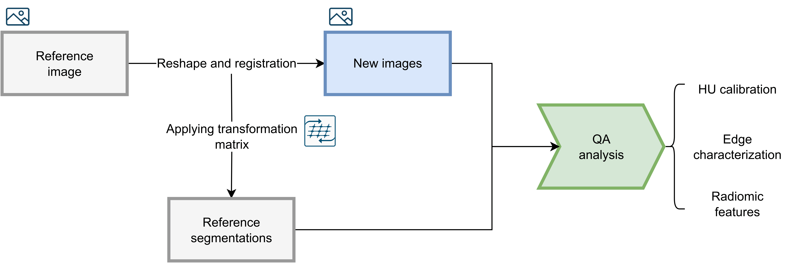
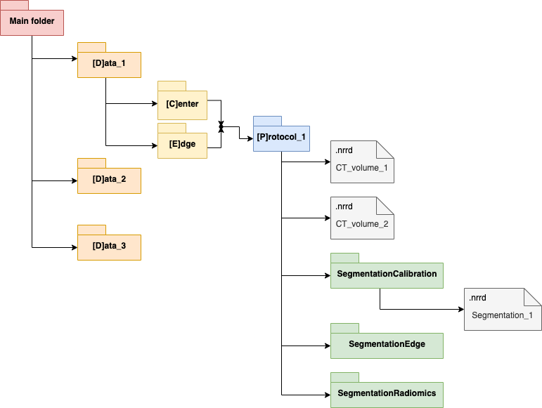

# Quality_Assurance

This package can perform the Quality Assurance of different CT images. It evaluates three different capacities from the CT: CT number calibration, edge detection and the calculation of radiomic features.

### Version:
_Currently under development_

This package can automatically perform QA for different CT volumes based on reference segmentations. It rigidly registers the referenece image (the one were the reference segmentations were taken) to the CT image to analyze. The result is saved in a transformation matrix that is later applied to the reference segmentations. An image of the workflow of the program is shown below.



The required structure for the DDBB is detailed below. Letter in brackets is requiered by the software to read the folder. _(It can be changed in the source code if other letters are desired)_. Reference segmentations should be stored in the different segmentations folders. 



### QA.py

This file executes the Quality Assurance program. Instructions appearing in console should be followed. The software will ask for the DDBB path, position of the phantom, the desired metrics, the path to save the results and the reference image. 

### Analysis.py

This file is intended to facilitate the user the analysis of the results obtained from _QA.py_. _(Still under development, all features haven't been added yet, some may not work with other phantoms)_

## Installation

This package was developed using Python 3.7, and all the necessary libraries are detailed in the file requirements.txt. All this libraries can be installed with pip by:

```
pip install -r requirements.txt
``` 
So far, it has only been possible to test the software with two different phantoms: Electron Density Phantom (CIRS) and Cheese Phantom (Accuray). It should be remarked that the phantom tested should not have different components that rotate form each other, which could lead to the rigid registration failing. 
