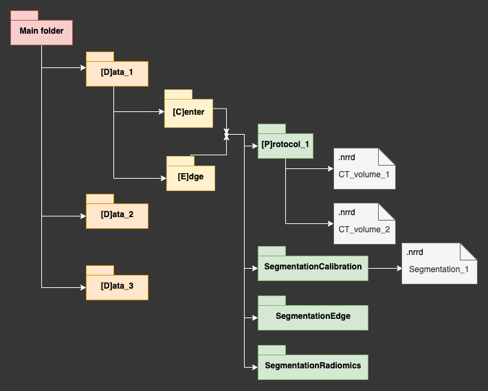

# Quality_Assurance

This package can perform the Quality Assurance of different CT images. It evaluates three different capacities from the CT: CT number calibration, edge detection and the calculation of radiomic features.

### Version:
_Currently under development_

This package can automatically perform QA for different CT volumes based on reference segmentations. It rigidly registers the referenece image (the one were the reference segmentations were taken) to the CT image to analyze. The result is saved in a transformation matrix that is later applied to the reference segmentations. An image of the workflow of the program is shown below.


The required structure for the DDBB is detailed below.



### QA.py

This file executes the Quality Assurance program. It will automatically check if new images have been added, and the will ask you to register them to the reference images. Once registered, the user can choose which part of the analysys to perform. The result is saved in a .xlsx file.

### Analysis.py

This file is intended to facilitate the user the analysis of the results obtained from _QA.py_. _(All features haven't been added yet)_

## Installation

This package was developed in Python 3.7, and all the necessary libraries are detailed in the file requirements.txt. All this libraries can be installed with pip by:

```
pip install -r requirements.txt
``` 
